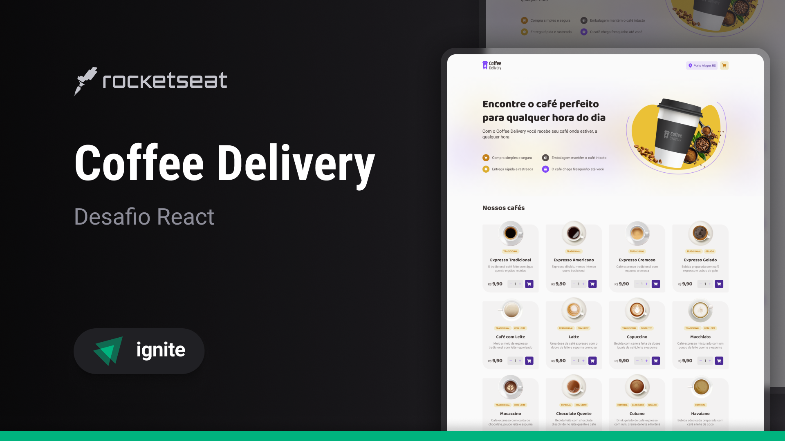

<!-- markdownlint-disable MD033 -->
<!-- markdownlint-disable MD041 -->

<div align="center">
   <a href="https://github.com/mgckaled">
      
   </a>
   
   
   <a href="https://github.com/mgckaled/ignite-react-desafio_coffee-delivery/commits/main">
      
   </a>
   
  
</div>

<br>

# Desafio Ignite React - Coffee Delivery

<div align="center">

[**Sobre o Projeto**](#sobre-o-projeto) &nbsp;&nbsp;&#124;&nbsp;&nbsp;
[**Deploy**](#deploy) &nbsp;&nbsp;&#124;&nbsp;&nbsp;
[**Tecnologias**](#tecnologias) &nbsp;&nbsp;&#124;&nbsp;&nbsp;
[**Layout**](#layout) &nbsp;&nbsp;&#124;&nbsp;&nbsp;
[**Configurações**](#configurações) &nbsp;&nbsp;&#124;&nbsp;&nbsp;
[**Licença**](#licença)

</div>

<br>

<p align="center">
  
</p>

## Sobre o Projeto

Nesse desafio, foi desenvolvido uma aplicação que gerenciar um carrinho de compras de uma cafeteria fictícia, contendo as seguintes funcionalidades:

- Listagem de produtos (cafés) disponíveis para compra
- Adicionar uma quantidade específicas de itens no carrinho
- Aumentar ou remover a quantidade de itens no carrinho
- Formulário para o usuário preencher o seu endereço
- Exibir o total de itens no carrinho no Header
- Exibir o valor total da soma de itens no carrinho multiplicados pelo valor

Conceitos utilizados:

- Estados
- ContextAPI
- LocalStorage
- Imutabilidade do estado
- Listas e chaves no ReactJS
- Propriedades
- Componentização

## Deploy

Indisponível.

## Tecnologias

- [`React`](https://reactnative.dev/)
- [`TypeScript`](https://www.typescriptlang.org/)
- [`Vite`](https://vitejs.dev/)
- [`Styled Components`](https://styled-components.com/)
- [`polished`](https://www.npmjs.com/package/polished)
- [`React Hook Form`](https://www.react-hook-form.com/)
- [`React Router DOM`](https://www.npmjs.com/package/react-router-dom)
- [`Zod`](https://zod.dev/)
- [`Phosphor Icons`](https://phosphoricons.com/)
- [`Immer`](https://www.npmjs.com/package/immer)

## Layout

Acesse o layout do projeto [`AQUI`](https://www.figma.com/file/83daQL81FxObNCx6ezxZXc).

É necessário ter uma conta no [Figma](https://figma.com) para acessar os layouts.

## Configurações

Necessário realizar as seguintes instalações:

- [Git](https://git-scm.com/)
- [npm](https://www.npmjs.com/)
- [Node](https://nodejs.org/)

Criar conta e configurar os serviços externos:

- [GitHub](https://github.com/)

Clonar repositório:

```bash
# Execute o comando git clone para realizar o clone do repositório
$ git clone https://github.com/mgkclaed/ignite-react-desafio_coffee-delivery.git
# Entre na pasta do repositório clonado
$ cd ignite-react-desafio_coffee-delivery
```

Dependências e inicialização:

```bash
## instalar dependências
$ npm i
```

## Licença

Distribuído sob a licença **_MIT_**. Veja [LICENSE](LICENSE) para mais informações.

## Autor

Feito com ❤️ por [`Marcel Kaled`](https://github.com/mgckaled/).
